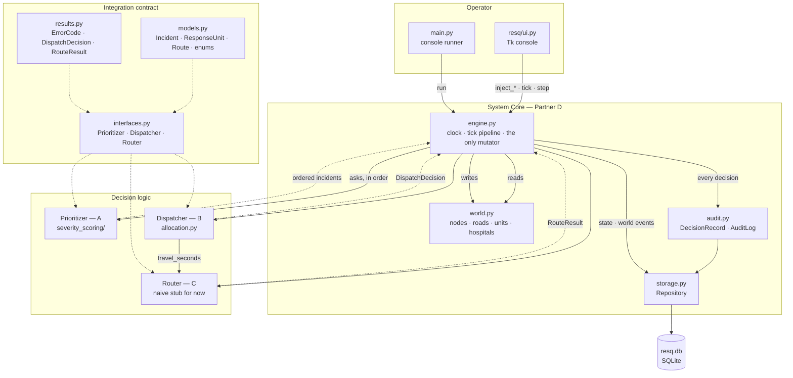
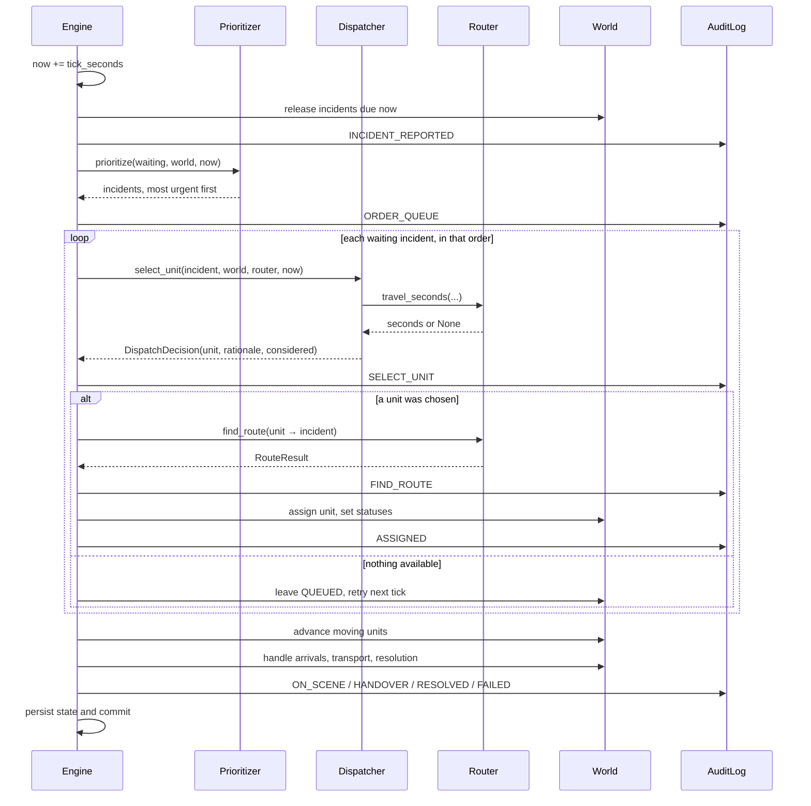
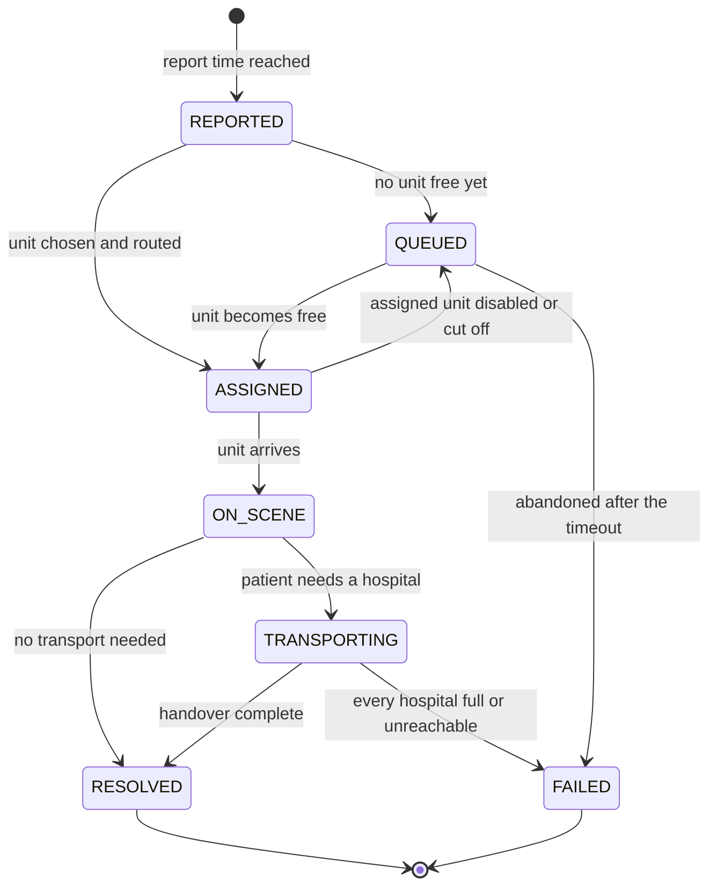
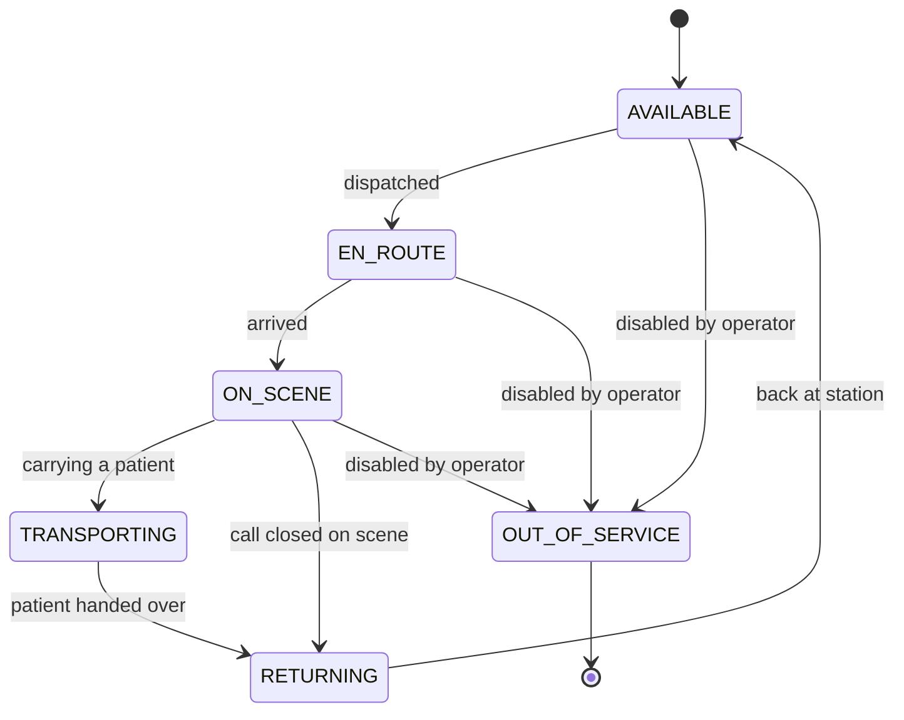
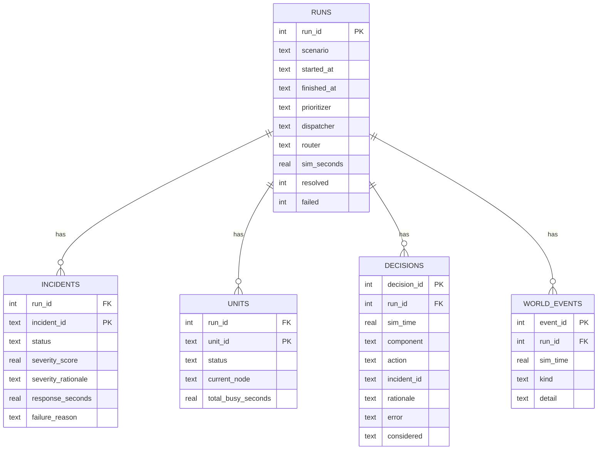

# Architecture and Data Model

Deliverables 4 and 5: the architecture diagram, and the data model behind it.

---

## 1. Component diagram



Solid arrows are calls. Dashed arrows are returned values and type dependencies.

The shape that matters: **every arrow into `world.py` comes from `engine.py`.**
A, B and C read the world and return decision objects; they never write. That
single constraint is what makes the audit log trustworthy — if the log says a
unit was dispatched at 14:03, the world was changed at 14:03 by the engine, in
the same call that wrote the record.

---

## 2. The tick pipeline



---

## 3. Incident lifecycle



`TRANSPORTING` is the hospital leg — it happens **after** `ON_SCENE`. The trip
out to the emergency is `ASSIGNED` on the incident and `EN_ROUTE` on the unit.
This matters because `docs/integration_contract.md` proposes an `IN_TRANSIT`
state meaning the opposite leg; see agenda item 1.

## 4. Unit lifecycle



---

## 5. Data model

### In memory

```mermaid
erDiagram
    WORLD ||--o{ NODE : contains
    WORLD ||--o{ EDGE : contains
    WORLD ||--o{ HOSPITAL : contains
    WORLD ||--o{ STATION : contains
    WORLD ||--o{ RESPONSE_UNIT : contains
    WORLD ||--o{ INCIDENT : contains
    RESPONSE_UNIT ||--o| ROUTE : "currently following"
    RESPONSE_UNIT }o--|| STATION : "home"
    INCIDENT }o--o| RESPONSE_UNIT : "assigned to"
    INCIDENT }o--o| HOSPITAL : "transported to"
    EDGE }o--|| NODE : from
    EDGE }o--|| NODE : to
```

Key fields, with the rules attached to them:

| Object | Field | Note |
|---|---|---|
| `Node` | `node_id` | Short uppercase — `N01`, `ST1`, `H1`. Never a name or an index |
| `Edge` | `base_seconds` | Free-flow travel time. **Always seconds** |
| `Edge` | `traffic_multiplier` | 1.0 normal, 3.0 gridlock |
| `Edge` | `cost_seconds` | Derived: `inf` if closed, else base × multiplier |
| `Edge` | key | `"N01->N02"` — one Edge per direction, so one way can close alone |
| `Hospital` | `capacity`, `occupied` | Stored. `free_beds` is derived, never stored |
| `Incident` | `severity_score`, `priority_rank`, `severity_rationale` | The only three fields A may write |
| `Incident` | `reported_at`, `assigned_at`, `arrived_at`, `resolved_at` | Simulation seconds, engine-owned |
| `ResponseUnit` | `total_busy_seconds` | Drives the utilisation metric |
| `Route` | `total_seconds`, `alternatives` | Alternatives are what let the audit screen show rejected paths |

### On disk



`incidents` and `units` are **upserted** — they hold the final state of the run.
`decisions` and `world_events` are **append-only** — they hold how it got there.
That asymmetry is deliberate: the decision chain is what the audit view reads
and what the rubric asks for, so it is the one thing never overwritten.

---

## 6. Why the contract is shaped this way

**One definition of every shared object, in code.** `models.py`, `results.py`
and `interfaces.py` are the contract. Prose that restates a schema drifts from
it; the 59 differences catalogued in `contract_comparison.md` are what happened
when two definitions ran in parallel for three days.

**Result objects rather than exceptions.** A component that cannot answer
returns a result carrying an `ErrorCode` and a rationale. Both success and
failure then look the same to the audit log, which means the UI has something to
show for "no unit was available" instead of a blank row — and the instructor is
deliberately going to create that condition.

**`considered` on every decision.** A chosen option with no rejected
alternatives is unfalsifiable. The list of what was rejected, and why, is the
difference between "it picked A3" and "it picked A3 over A1 because A1 covers
the only northern station".

**Protocols, not base classes.** Teammates implement a shape, not an
inheritance. Nobody has to import from `resq/` to satisfy the interface, and the
engine never imports their modules — it receives objects through its
constructor.

**Everything in seconds.** One unit throughout, and the unit is in the field
name wherever there is any doubt. Ticks are a rendering choice for the UI clock
and never reach a stored field, because a tick length is a configuration knob
and changing it would retroactively alter the meaning of every stored timestamp.
